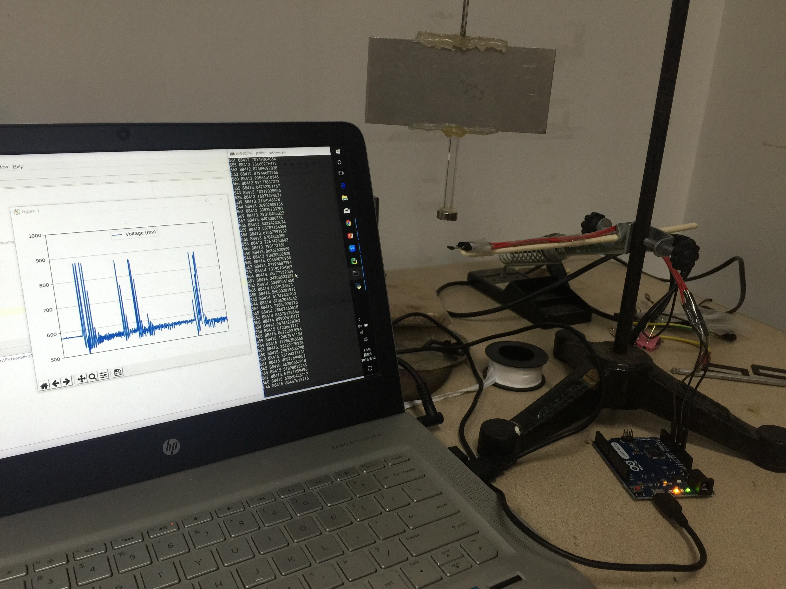

# CUPT Seismograph

本程序是在CUPT比赛的『地震仪』题目中，用于通过串口读取数据的。  
题目内容如下：  
> **Invent Yourself**  
> Construct a simple seismograph that amplifies a local disturbance by mechanical, optical or electrical methods. Determine the typical response curve of your device and investigate the parameters of the damping constant. What is the maximum amplification that you can achieve?  

> **自主发明**  
> 建造一个可以通过力学、光学或电学方法放大局部扰动的简单地震仪。确定你装置的标准响应曲线并且研究阻尼常数的参量。你能达到的最大放大率是多少？  

地震的力学效应通过弹簧变成位移，而通过霍尔片和磁铁，位移将通过测量电压体现出来。只要预先通过理论计算磁场强度，并标定出位移与电压的关系，即可作出地震反应谱。  
电压通过Arduino进行读取，并利用串口传输给电脑。电脑通过Python实时记录数据并显示图像，还可以进行进一步的操作，例如分析频谱等。  
AnalogRead文件夹内是需要编译进Arduino执行的模拟输入和串口通讯程序，使用Arduino IDE打开它并编译上传至Arduino即可。  
arduino.py需使用python3运行，启动后会监听串口。Arduino接入的串口因设备而异，类Unix系统下请通过查看`/dev/`目录确定Arduino是哪个设备，例如`/dev/tty.usbmodem1421`；Windows下一般为`COM4`，`COM6`等，请自行确认，并修改代码。9600是波特率，无需修改。只要正确接收到了信号，便会实时对数据绘图。  


## 使用方法

需要Python3和pip3。

```bash
# Clone this repository
git clone https://github.com/stevenjoezhang/CUPT-Seismograph.git
# Go into the repository
cd CUPT-Seismograph
# Install dependencies
pip3 install -r requirements.txt
```
将`AnalogRead.ino`通过Arduino IDE编译上传至设备，然后通过USB将设备连接到电脑。  
在电脑上查看设备挂载的位置，并对应修改`arduino.py`中`serial.Serial`的参数。执行`arduino.py`即可实时绘图。

## Credits
* [Mimi](https://zhangshuqiao.org) Developer of this project.

## License
Released under the GNU General Public License v3  
http://www.gnu.org/licenses/gpl-3.0.html
